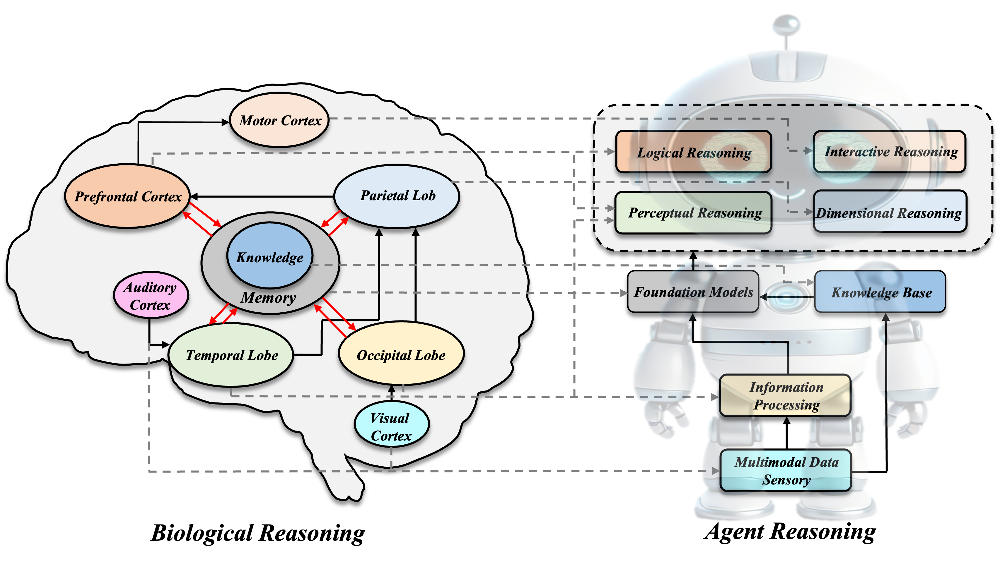

# Awesome-Neuroscience-Agent-Reasoning
Neuroscience Inspired Agent Reasoning Framework

## 📢 News

## Agentic Reasoning: A Novel Systematic Framework and Survey from Neuroscience Perspective

## Latest Reasoning Surveys
* **Multimodal Chain-of-Thought Reasoning: A Comprehensive Survey (arXiv 2025)** [[Paper]](https://arxiv.org/abs/2503.12605) [[Code]](https://github.com/yaotingwangofficial/Awesome-MCoT)
* **Stop Overthinking: A Survey on Efficient Reasoning for Large Language Models (arXiv 2025)** [[Paper]](https://arxiv.org/abs/2503.16419) [[Code]](https://github.com/Eclipsess/Awesome-Efficient-Reasoning-LLMs)
* **From System 1 to System 2: A Survey of Reasoning Large Language Models (arXiv 2025)** [[Paper]](https://arxiv.org/abs/2502.17419) [[Code]](https://github.com/zzli2022/Awesome-System2-Reasoning-LLM)
* **A Survey of Reasoning with Foundation Models (arXiv 2023)** [[Paper]](https://arxiv.org/abs/2312.11562) [[Code]](https://github.com/reasoning-survey/Awesome-Reasoning-Foundation-Models)

## Agent Reasoning Framework
- [Awesome-Neuroscience-Agent-Reasoning](#awesome-neuroscience-agent-reasoning)
  - [📢 News](#-news)
  - [Agentic Reasoning: A Novel Systematic Framework and Survey from Neuroscience Perspective](#agentic-reasoning-a-novel-systematic-framework-and-survey-from-neuroscience-perspective)
  - [Latest Reasoning Surveys](#latest-reasoning-surveys)
  - [Agent Reasoning Framework](#agent-reasoning-framework)
  - [Dimension-based Reasoning](#dimension-based-reasoning)
  - [Part 1: Spatial Reasoning](#part-1-spatial-reasoning)
  - [Part 2: Temporal Reasoning](#part-2-temporal-reasoning)
    - [LLM based](#llm-based)
    - [Graph based](#graph-based)
  - [Perception-based Reasoning](#perception-based-reasoning)
  - [Part 3: Visual Reasoning](#part-3-visual-reasoning)
    - [VLM based](#vlm-based)
    - [LLM based](#llm-based-1)
    - [Neuro-symbolic based](#neuro-symbolic-based)
    - [RL based](#rl-based)
  - [Part 4: Lingual Reasoning](#part-4-lingual-reasoning)
    - [CoT based](#cot-based)
    - [RL based](#rl-based-1)
  - [Part 5: Auditory Reasoning](#part-5-auditory-reasoning)
    - [Model/Multimodal Integration](#modelmultimodal-integration)
    - [Counter Factual Learning](#counter-factual-learning)
  - [Part 6: Tactile Reasoning](#part-6-tactile-reasoning)
  - [Interaction-based Reasoning](#interaction-based-reasoning)
  - [Part 7: Reasoning based on Agent-Agent Interaction](#part-7-reasoning-based-on-agent-agent-interaction)
  - [Part 8: Reasoning based on Agent-Human Interaction](#part-8-reasoning-based-on-agent-human-interaction)
  - [Logic-based Reasoning](#logic-based-reasoning)
  - [Part 9: Inductive Reasoning](#part-9-inductive-reasoning)
  - [Part 10: Deductive Reasoning](#part-10-deductive-reasoning)
  - [Part 11: Abductive Reasoning](#part-11-abductive-reasoning)
  - [Evaluation\&Benchmark](#evaluationbenchmark)
## Dimension-based Reasoning
## Part 1: Spatial Reasoning
* **Visual Spatial Reasoning (TACL 2023)** [[Paper]](https://doi.org/10.1162/tacl_a_00566)
* **SpatialVLM: Endowing Vision-Language Models with Spatial Reasoning Capabilities (CVPR 2024)** [[Paper]](https://openaccess.thecvf.com/content/CVPR2024/papers/Chen_SpatialVLM_Endowing_Vision-Language_Models_with_Spatial_Reasoning_Capabilities_CVPR_2024_paper.pdf))
* **Large Language Models are Visual Reasoning Coordinators (NeurIPS 2023)** [[Paper]](https://proceedings.neurips.cc/paper_files/paper/2023/file/ddfe6bae7b869e819f842753009b94ad-Paper-Conference.pdf)
* **Is a Picture Worth a Thousand Words? Delving into Spatial Reasoning for Vision-Language Models (NeurIPS 2024)** [[Paper]](https://proceedings.neurips.cc/paper_files/paper/2024/file/89cc5e613d34f90de90c21e996e60b30-Paper-Conference.pdf)
* **Learning to Localize Objects Improves Spatial Reasoning in Visual-LLMs (CVPR 2024)** [[Paper]](https://openaccess.thecvf.com/content/CVPR2024/papers/Ranasinghe_Learning_to_Localize_Objects_Improves_Spatial_Reasoning_in_Visual-LLMs_CVPR_2024_paper.pdf)
* **Advancing Spatial Reasoning in Large Language Models: An In-Depth Evaluation and Enhancement Using the StepGame Benchmark (AAAI 2024)** [[Paper]](https://ojs.aaai.org/index.php/AAAI/article/view/29811/31406)
* **SpatialPIN: Enhancing Spatial Reasoning Capabilities of Vision-Language Models through Prompting and Interacting 3D Priors (NeurIPS 2024)** [[Paper]](https://arxiv.org/pdf/2403.13438)
* **SpatialRGPT: Grounded Spatial Reasoning in Vision Language Models (NeurIPS 2024)** [[Paper]](https://arxiv.org/pdf/2406.01584)
* **Unleashing the Temporal-Spatial Reasoning Capacity of GPT for Training-Free Audio and Language Referenced Video Object Segmentation (AAAI 2025)** [[Paper]](https://arxiv.org/pdf/2408.15876)
* **Metric Reasoning in Large Language Models (ACM GIS 2024)** [[Paper]](https://dl.acm.org/doi/abs/10.1145/3678717.3691226)
* **Weakly-supervised 3D Spatial Reasoning for Text-based Visual Question Answering (IEEE TIP 2023)** [[Paper]](https://ieeexplore.ieee.org/abstract/document/10141570)
* **Towards Grounded Visual Spatial Reasoning in Multi-Modal Vision Language Models (DMLR @ICLR 2024)** [[Paper]](https://arxiv.org/pdf/2308.09778)
* **StarCraftImage: A Dataset for Prototyping Spatial Reasoning Methods for Multi-Agent Environments (CVPR 2023)** [[Paper]](https://openaccess.thecvf.com/content/CVPR2023/papers/Kulinski_StarCraftImage_A_Dataset_for_Prototyping_Spatial_Reasoning_Methods_for_Multi-Agent_CVPR_2023_paper.pdf)
* **A Spatial Hierarchical Reasoning Network for Remote Sensing Visual Question Answering (IEEE 2023)** [[Paper]](https://ieeexplore.ieee.org/abstract/document/10018408)
* **Structured Spatial Reasoning with Open Vocabulary Object Detectors (arXiv 2024)** [[Paper]](https://arxiv.org/abs/2410.07394)
* **A Pilot Evaluation of ChatGPT and DALL-E 2 on Decision Making and Spatial Reasoning (arXiv 2023)** [[Paper]](https://arxiv.org/abs/2302.09068)
* **SpatialCoT: Advancing Spatial Reasoning through Coordinate Alignment and Chain-of-Thought for Embodied Task Planning (arXiv 2025)** [[Paper]](https://arxiv.org/pdf/2501.10074) [[Code]](https://spatialcot.github.io/)
* **Dialectical Language Model Evaluation: An Initial Appraisal of the Commonsense Spatial Reasoning Abilities of LLMs (arXiv 2023)** [[Paper]](https://arxiv.org/abs/2304.11164)
* **Reframing Spatial Reasoning Evaluation in Language Models: A Real-World Simulation Benchmark for Qualitative Reasoning (IJCAI 2024)** [[Paper]](https://arxiv.org/pdf/2405.15064)
* **What's "Up" with Vision-Language Models? Investigating Their Struggle with Spatial Reasoning (EMNLP 2023)** [[Paper]](https://arxiv.org/pdf/2310.19785) [[Code]](https://github.com/amitakamath/whatsup_vlms)
* **Reasoning Paths with Reference Objects Elicit Quantitative Spatial Reasoning in Large Vision-Language Models (arXiv 2024)** [[Paper]](https://arxiv.org/pdf/2409.09788) [[Code]]
* **Chain-of-Symbol Prompting For Spatial Reasoning in Large Language Models (COLM 2024)** [[Paper]](https://openreview.net/pdf?id=Hvq9RtSoHG)
* **GRASP: A Grid-Based Benchmark for Evaluating Commonsense Spatial Reasoning (arXiv 2024)** [[Paper]](https://arxiv.org/pdf/2407.01892?)
* **Graph-Based Spatial Reasoning for Tracking Landmarks in Dynamic Laparoscopic Environments (IEEE RA-L)** [[Paper]]
* **TopV-Nav: Unlocking the Top-View Spatial Reasoning Potential of MLLM for Zero-shot Object Navigation (arXiv 2024)** [[Paper]]
* **End-to-End Navigation with Vision Language Models: Transforming Spatial Reasoning into Question-Answering (arXiv 2024)** [[Paper]]
* **I Know About "Up"! Enhancing Spatial Reasoning in Visual Language Models Through 3D Reconstruction (arXiv 2024)** [[Paper]]
* **Emma-X: An Embodied Multimodal Action Model with Grounded Chain of Thought and Look-ahead Spatial Reasoning (arXiv 2024)** [[Paper]]

## Part 2: Temporal Reasoning
### LLM based
 * **Text-to-ECG: 12-Lead Electrocardiogram Synthesis Conditioned on Clinical Text Reports (ICASSP 2023)** [[Paper]](https://arxiv.org/abs/2303.09395)
 * **Can Brain Signals Reveal Inner Alignment with Human Languages (EMNLP 2023 Findings)** [[Paper]](https://arxiv.org/abs/2208.06348) [[Code]](https://github.com/Jielin-Qiu/EEG_Language_Alignment)
 * **TempoGPT: Enhancing Temporal Reasoning via Quantizing Embedding (arXiv 2025)** [[Paper]](https://arxiv.org/abs/2501.07335) [[Code]](https://github.com/zhanghaochuan20/TempoGPT)
 * **PromptCast: A New Prompt-based Learning Paradigm for Time Series Forecasting(IEEE TKDE 2023)** [[Paper]](https://arxiv.org/abs/2210.08964)
 * **Large Language Models Can Learn Temporal Reasoning (ACL 2024)** [[Paper]](https://arxiv.org/abs/2401.06853)
 * **Back to the future: Towards explainable temporal reasoning with large language models (WWW 2024)** [[Paper]](https://dl.acm.org/doi/abs/10.1145/3589334.3645376)
 * **Enhancing Temporal Sensitivity and Reasoning for Time-Sensitive Question Answering (EMNLP 2024 Findings)** [[Paper]](https://www.arxiv.org/abs/2409.16909)
 * **Temporal Reasoning Transfer from Text to Video (ICLR 2025)** [[Paper]](https://arxiv.org/abs/2410.06166) [[Code]](https://video-t3.github.io/)
 * **Timo: Towards Better Temporal Reasoning for Language Models (COLM 2024)** [[Paper]](https://arxiv.org/abs/2406.14192) [[Code]](https://github.com/zhaochen0110/Timo)
 * 

### Graph based
 * **Know-Evolve: Deep Temporal Reasoning for Dynamic Knowledge Graphs (ICML 2017)** [[Paper]](https://arxiv.org/abs/1705.05742)
 * **Event Graph Guided Compositional Spatial-Temporal Reasoning for Video Question Answering (IEEE TIP 2024)** [[Paper]](https://ieeexplore.ieee.org/abstract/document/10418133/) [[Code]](https://github.com/ByZ0e/HSTT)
 * **Temporal knowledge graph reasoning with historical contrastive learning (AAAI 2023)** [[Paper]](https://ojs.aaai.org/index.php/AAAI/article/view/25601)
 * **Temporal inductive path neural network for temporal knowledge graph reasoning (Artificial Intelligence 2024)** [[Paper]](https://www.sciencedirect.com/science/article/pii/S0004370224000213)
 * **An improving reasoning network for complex question answering over temporal knowledge graphs (Applied Intelligence 2023)** [[Paper]](https://link.springer.com/article/10.1007/s10489-022-03913-6)
 ## Perception-based Reasoning
 ## Part 3: Visual Reasoning
### VLM based
  * **GeReA: Question-Aware Prompt Captions for Knowledge-based Visual Question Answering (arXiv 2024)** [[Paper]](https://arxiv.org/pdf/2402.02503) [[Code]](https://github.com/Upper9527/GeReA)
  * **Lisa: Reasoning segmentation via large language model (CVPR 2024)** [[Paper]](http://openaccess.thecvf.com/content/CVPR2024/papers/Lai_LISA_Reasoning_Segmentation_via_Large_Language_Model_CVPR_2024_paper.pdf) [[Code]](https://github.com/dvlabresearch/LISA)
  * **KN-VLM: KNowledge-guided Vision-and-Language Model for visual abductive reasoning (Research Square 2025)** [[Paper]](https://www.researchsquare.com/article/rs-4934011/latest.pdf)
  * **Q&A Prompts: Discovering Rich Visual Clues through Mining Question-Answer Prompts for VQA requiring Diverse World Knowledge (ECCV 2024)** [[Paper]](https://arxiv.org/pdf/2401.10712) [[Code]](https://github.com/WHB139426/QA-Prompts)
### LLM based
  * **Large language models are visual reasoning coordinators (NeurIPS 2023)** [[Paper]](https://proceedings.neurips.cc/paper_files/paper/2023/file/ddfe6bae7b869e819f842753009b94ad-Paper-Conference.pdf) [[Code]](https://github.com/cliangyu/Cola)
  * **Enhancing LLM Reasoning via Vision-Augmented Prompting (NeurIPS 2024)** [[Paper]](https://proceedings.neurips.cc/paper_files/paper/2024/file/328c922d068dd4ccb23cec5c64e6c7fc-Paper-Conference.pdf)
  * **Improving zero-shot visual question answering via large language models with reasoning question prompts (ACM 2023)** [[Paper]](https://dl.acm.org/doi/pdf/10.1145/3581783.3612389) [[Code]](https://github.com/ECNU-DASE-NLP/RQP)
  * **Visual Chain-of-Thought Prompting for Knowledge-Based Visual Reasoning (AAAI 2024)** [[Paper]](https://ojs.aaai.org/index.php/AAAI/article/view/27888/27801)
  * **Visual CoT: Advancing Multi-Modal Language Models with a Comprehensive Dataset and Benchmark for Chain-of-Thought Reasoning (NeurIPS 2024)** [[Paper]](https://proceedings.neurips.cc/paper_files/paper/2024/file/0ff38d72a2e0aa6dbe42de83a17b2223-Paper-Datasets_and_Benchmarks_Track.pdf) [[Code]](https://github.com/deepcs233/Visual-CoT)
  * **Visual chain of thought: bridging logical gaps with multimodal infillings (arXiv 2023)** [[Paper]](https://arxiv.org/pdf/2305.02317) [[Code]](https://github.com/dannyrose30/VCOT)
  * **End-to-End Chart Summarization via Visual Chain-of-Thought in Vision-Language Models (arXiv 2025)** [[Paper]](https://arxiv.org/pdf/2502.17589)
  * **Llava-o1: Let vision language models reason step-by-step (arXiv 2024)** [[Paper]](https://arxiv.org/pdf/2411.10440?) [[Code]](https://github.com/PKU-YuanGroup/LLaVA-CoT)
### Neuro-symbolic based
  * **ExoViP: Step-by-step Verification and Exploration with Exoskeleton Modules for Compositional Visual Reasoning (COLM 2024)** [[Paper]](https://arxiv.org/pdf/2408.02210) [[Code]](https://github.com/bigai-nlco/ExoViP)
  * **Visual programming: Compositional visual reasoning without training (CVPR 2023)** [[Paper]](https://openaccess.thecvf.com/content/CVPR2023/papers/Gupta_Visual_Programming_Compositional_Visual_Reasoning_Without_Training_CVPR_2023_paper.pdf) [[Code]](https://prior.allenai.org/projects/visprog)
  * **Vipergpt: Visual inference via python execution for reasoning (CVPR 2023)** [[Paper]](http://openaccess.thecvf.com/content/ICCV2023/papers/Suris_ViperGPT_Visual_Inference_via_Python_Execution_for_Reasoning_ICCV_2023_paper.pdf) [[Code]](https://github.com/cvlab-columbia/viper)
### RL based
  * **HYDRA: A Hyper Agent for Dynamic Compositional Visual Reasoning (ECCV 2024)** [[Paper]](https://arxiv.org/pdf/2403.12884) [[Code]](https://github.com/ControlNet/HYDRA)
  * **Vision-r1: Incentivizing reasoning capability in multimodal large language models (arXiv 2025)** [[Paper]](https://arxiv.org/pdf/2503.06749) [[Code]](https://github.com/Osilly/Vision-R1) [[Code]](https://github.com/Osilly/Vision-R1)
  * **Visual-rft: Visual reinforcement fine-tuning (arXiv 2025)** [[Paper]](https://arxiv.org/pdf/2503.01785?) [[Code]](https://github.com/Liuziyu77/Visual-RFT)
  * **Medvlm-r1: Incentivizing medical reasoning capability of vision-language models (vlms) via reinforcement learning (arXiv 2025)** [[Paper]](https://arxiv.org/pdf/2502.19634) [[Code]](https://huggingface.co/JZPeterPan/MedVLM-R1)
  * **VLM-RL: A Unified Vision Language Models and Reinforcement Learning Framework for Safe Autonomous Driving (arXiv 2024)** [[Paper]](https://arxiv.org/pdf/2412.15544) [[Code]](https://zilin-huang.github.io/VLM-RL-website)

 ## Part 4: Lingual Reasoning
### CoT based
  * **Chain-of-Thought Prompting Elicits Reasoning in Large Language Models (NeurIPS 2022)** [[Paper]](https://arxiv.org/abs/2201.11903)
  * **Self-Consistency Improves Chain of Thought Reasoning in Language Models (ICLR 2022)** [[Paper]](https://www.semanticscholar.org/paper/5f19ae1135a9500940978104ec15a5b8751bc7d2)
  * **Tree of Thoughts: Deliberate Problem Solving with Large Language Models (NeurIPS 2023)** [[Paper]](https://www.semanticscholar.org/paper/2f3822eb380b5e753a6d579f31dfc3ec4c4a0820) [[Code]](https://github.com/princeton-nlp/tree-of-thought-llm)
  * **Graph of Thoughts: Solving Elaborate Problems with Large Language Models (AAAI 2023)** [[Paper]](https://www.semanticscholar.org/paper/aade40af0d85b0b4fe15c97f6222d5c2e4d6d9b3) [[Code]](https://github.com/spcl/graph-of-thoughts)
  * **Automatic Prompt Augmentation and Selection with Chain-of-Thought from Labeled Data (EMNLP 2023)** [[Paper]](https://www.semanticscholar.org/paper/1358f90705b05cdb20ebe6799b02196205e7e9f0) [[Code]](https://github.com/SHUMKASHUN/Automate-CoT)
  * **Active Prompting with Chain-of-Thought for Large Language Models (ACL 2023)** [[Paper]](https://www.semanticscholar.org/paper/3fc3460c4554a28e489a0ea6ef067b79b7d301d9) [[Code]](https://github.com/shizhediao/active-prompt)
  * **Large Language Models Are Reasoning Teachers (ACL 2023)** [[Paper]](https://arxiv.org/abs/2212.10071) [[Code]](https://github.com/itsnamgyu/reasoning-teacher)
  * **Chain of Code: Reasoning with a Language Model-Augmented Code Emulator (ICML 2024)** [[Paper]](https://arxiv.org/abs/2312.04474) [[Code]](https://colab.research.google.com/drive/1_i9-LeAZyWoYNt0Oejej-JU0xhHahVFj?usp=sharing)
  * **Abstraction-of-Thought Makes Language Models Better Reasoners (EMNLP 2024)** [[Paper]](https://arxiv.org/abs/2406.12442) [[Code]](https://github.com/Raising-hrx/Abstraction-of-Thought)
  * **Enhancing Zero-Shot Chain-of-Thought Reasoning in Large Language Models through Logic (COLING 2024)** [[Paper]](https://arxiv.org/abs/2309.13339) [[Code]](https://github.com/xf-zhao/LoT)
  * **Path-of-Thoughts: Extracting and Following Paths for Robust Relational Reasoning with Large Language Models (arXiv 2024)** [[Paper]](https://arxiv.org/abs/2412.17963)
  * **Stepwise Self-Consistent Mathematical Reasoning with Large Language Models (arXiv 2024)** [[Paper]](https://arxiv.org/abs/2402.17786) [[Code]](https://github.com/zhao-zilong/ssc-cot)
  * **Chain-of-Thought Reasoning Without Prompting (arXiv 2024)** [[Paper]](https://arxiv.org/abs/2402.10200)
  * **Interleaved-Modal Chain-of-Thought (CVPR 2025)** [[Paper]](https://arxiv.org/abs/2411.19488) [[Code]](https://github.com/jungao1106/ICoT)
  * **CoAT: Chain-of-Associated-Thoughts Framework for Enhancing Large Language Models Reasoning (arXiv 2025)** [[Paper]](https://arxiv.org/abs/2502.02390)
  * **Chain of Draft: Thinking Faster by Writing Less (arXiv 2025)** [[Paper]](https://arxiv.org/abs/2502.18600) [[Code]](https://github.com/sileix/chain-of-draft)
### RL based
  * **Making Large Language Models Better Reasoners with Step-Aware Verifier (arXiv 2023)** [[Paper]](https://arxiv.org/abs/2206.02336) [[Code]](https://github.com/microsoft/CodeT/tree/main/DIVERSE)
  * **Large Language Models Cannot Self-Correct Reasoning Yet (ICLR 2024)** [[Paper]](https://arxiv.org/abs/2310.01798)
  * **Free Process Rewards without Process Labels (arXiv 2024)** [[Paper]](https://arxiv.org/abs/2412.01981) [[Code]](https://github.com/PRIME-RL/ImplicitPRM)
  * **Math-Shepherd: Verify and Reinforce LLMs Step-by-step without Human Annotations (arXiv 2024)** [[Paper]](https://arxiv.org/abs/2312.08935) [[Code]](https://huggingface.co/datasets/peiyi9979/Math-Shepherd)
  * **Agent Q: Advanced Reasoning and Learning for Autonomous AI Agents(arXiv 2024)** [[Paper]](https://arxiv.org/abs/2408.07199) [[Code]](https://github.com/sentient-engineering/agent-q)
  * **Self-playing Adversarial Language Game Enhances LLM Reasoning(NeurIPS 2024)** [[Paper]](https://arxiv.org/abs/2404.10642) [[Code]](https://github.com/Linear95/SPAG)
  * **Does RLHF Scale? Exploring the Impacts From Data, Model, and Method (arXiv 2024)** [[Paper]](https://arxiv.org/abs/2412.06000)
  * **OVM, Outcome-supervised Value Models for Planning in Mathematical Reasoning (NAACL 2024)** [[Paper]](https://arxiv.org/abs/2311.09724) [[Code]](https://github.com/FreedomIntelligence/OVM)
  * **Step-DPO: Step-wise Preference Optimization for Long-chain Reasoning of LLMs (arXiv 2024)** [[Paper]](https://arxiv.org/abs/2406.18629) [[Code]](https://github.com/dvlab-research/Step-DPO)
  * **AutoPSV: Automated Process-Supervised Verifier (arXiv 2024)** [[Paper]](https://arxiv.org/abs/2405.16802) [[Code]](https://github.com/rookie-joe/AutoPSV)
  * **ReST-MCTS*: LLM Self-Training via Process Reward Guided Tree Search (arXiv 2024)** [[Paper]](https://arxiv.org/abs/2406.03816) [[Code]](https://github.com/THUDM/ReST-MCTS)
  * **Improve Mathematical Reasoning in Language Models by Automated Process Supervision (arXiv 2024)** [[Paper]](https://arxiv.org/abs/2406.06592) [[Code]](https://github.com/sanowl/OmegaPRM)
  * **DeepSeek-R1: Incentivising Reasoning Capability in LLMs via Reinforcement Learning (arXiv 2025)** [[Paper]](https://arxiv.org/pdf/2501.12948) [[Code]](https://github.com/deepseek-ai/DeepSeek-R1)
  * **Reasoning with Reinforced Functional Token Tuning (arXiv 2025)** [[Paper]](https://arxiv.org/abs/2502.13389) [[Code]](https://github.com/sastpg/RFTT)
  * **Logic-RL: Unleashing LLM Reasoning with Rule-Based Reinforcement Learning (arXiv 2025)** [[Paper]](https://arxiv.org/abs/2502.14768) [[Code]](https://github.com/Unakar/Logic-RL)
  * **Advancing Language Model Reasoning through Reinforcement Learning and Inference Scaling (arXiv 2025)** [[Paper]](https://arxiv.org/abs/2501.11651) [[Code]](https://github.com/THUDM/T1)
  * **Satori: Reinforcement Learning with Chain-of-Action-Thought Enhances LLM Reasoning via Autoregressive Search (arXiv 2025)** [[Paper]](https://arxiv.org/abs/2502.02508) [[Code]](https://github.com/satori-reasoning/Satori)
  * **Exploring the Limit of Outcome Reward for Learning Mathematical Reasoning (arXiv 2025)** [[Paper]](https://arxiv.org/abs/2502.06781) [[Code]](https://github.com/InternLM/OREAL)
  * **QLASS: Boosting Language Agent Inference via Q-Guided Stepwise Search (arXiv 2025)** [[Paper]](https://arxiv.org/abs/2502.02584)
  * **DHP: Discrete Hierarchical Planning for Hierarchical Reinforcement Learning Agents (arXiv 2025)** [[Paper]](https://arxiv.org/abs/2502.01956)
  * **DuoGuard: A Two-Player RL-Driven Framework for Multilingual LLM Guardrails (arXiv 2025)** [[Paper]](https://arxiv.org/abs/2502.05163) [[Code]](https://github.com/yihedeng9/DuoGuard)
  * **On the Emergence of Thinking in LLMs I: Searching for the Right Intuition (arXiv 2025)** [[Paper]](https://arxiv.org/abs/2502.06773)
  * **KIMI K1.5:SCALING REINFORCEMENT LEARNING WITH LLMS (arXiv 2025)** [[Paper]](https://arxiv.org/pdf/2501.12599) [[Code]](https://github.com/MoonshotAI/Kimi-k1.5)
 
 ## Part 5: Auditory Reasoning
### Model/Multimodal Integration
 * **Joint audio and speech understanding (IEEE ASRU 2023)** [[Paper]](https://arxiv.org/abs/2309.14405) [[Code]](https://github.com/yuangongnd/ltu)
 * **Listen, think, and understand (ICLR 2024)** [[Paper]](https://arxiv.org/abs/2305.10790) [[Code]](https://github.com/YuanGongND/ltu)
 * **Toward Explainable Physical Audiovisual Commonsense Reasoning (ACMMM 2024)** [[Paper]](https://dl.acm.org/doi/abs/10.1145/3664647.3681074)
 * **BAT: Learning to Reason about Spatial Sounds with Large Language Models (ICML 2024)** [[Paper]](https://arxiv.org/abs/2402.01591) [[Code]](https://zhishengzheng.com/BAT/)
 * **GAMA: A Large Audio-Language Model with Advanced Audio Understanding and Complex Reasoning Abilities (arXiv 2024)** [[Paper]](https://arxiv.org/abs/2406.11768) [[Code]](https://github.com/Sreyan88/GAMA)
 * **What do MLLMs hear? Examining reasoning with text and sound components in Multimodal Large Language Models (arXiv 2024)** [[Paper]](https://arxiv.org/abs/2406.04615)
### Counter Factual Learning
 * **Disentangled counterfactual learning for physical audiovisual commonsense reasoning (NeurIPS 2024)** [[Paper]](https://proceedings.neurips.cc/paper_files/paper/2023/hash/29571f8fda54fe93631c41aad4215abc-Abstract-Conference.html)
 * **Learning Audio Concepts from Counterfactual Natural Language. (ICASSP 2024)** [[Paper]](https://arxiv.org/abs/2401.04935)

 ## Part 6: Tactile Reasoning
 ## Interaction-based Reasoning
 ## Part 7: Reasoning based on Agent-Agent Interaction

 ## Part 8: Reasoning based on Agent-Human Interaction
 ## Logic-based Reasoning
 ## Part 9: Inductive Reasoning

 ## Part 10: Deductive Reasoning

 ## Part 11: Abductive Reasoning
 
 ## Benchmark
 ### Temporal Reasoning
 * **AGQA: A Benchmark for Compositional Spatio-Temporal Reasoning (CVPR 2021)** [[Paper]](https://arxiv.org/abs/2103.16002)
 * **Timebench: A comprehensive evaluation of temporal reasoning abilities in large language models (ACL 2024)** [[Paper]](https://arxiv.org/abs/2311.17667) [[Code]](https://github.com/zchuz/TimeBench)
 * **TRAM: Benchmarking Temporal Reasoning for Large Language Models (ACL 2024 findings)** [[Paper]](https://arxiv.org/abs/2310.00835) [[Code]](https://github.com/EternityYW/TRAM-Benchmark)
 * **Towards benchmarking and improving the temporal reasoning capability of large language models (ACL 2023)**
 
