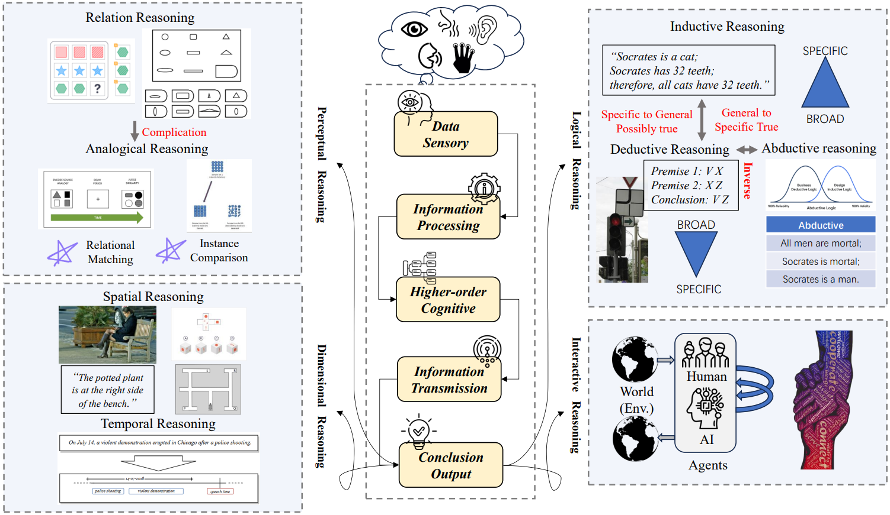

# Awesome-Neuroscience-Agent-Reasoning

      

Neuroscience Inspired Agent Reasoning Framework

## 📢 News

## Agentic Reasoning: A Novel Systematic Framework and Survey from Neuroscience Perspective

The overview of the reasoning process and classification of reasoning behavior from a neuro-perspective. This diagram presents a comprehensive framework of reasoning inspired by human cognitive and neural mechanisms. At the center, a hierarchical reasoning pipeline, spanning data sensory input, information processing, higher-order cognition, and conclusion generation, mirrors the flow of information in biological systems. Surrounding this core are five major categories of reasoning behaviors: perceptual reasoning, driven by multisensory integration; dimensional reasoning, encompassing spatial and temporal inference; relation reasoning, involving analogical thinking and relational matching; logical reasoning, covering inductive, deductive, and abductive logic; and interactive reasoning, focusing on agent-agent and agent-human collaboration within dynamic environments. Together, these components establish a neuro-cognitively grounded taxonomy that bridges biological inspiration and computational implementation in artificial intelligence systems.

## Latest Reasoning Surveys
* **Multimodal Chain-of-Thought Reasoning: A Comprehensive Survey (arXiv 2025)**
  
  
* **Stop Overthinking: A Survey on Efficient Reasoning for Large Language Models (arXiv 2025)**
  
  
* **From System 1 to System 2: A Survey of Reasoning Large Language Models (arXiv 2025)** 
  
  
* **A Survey of Reasoning with Foundation Models (arXiv 2023)**
  
  
  

## Agent Reasoning Framework
- [Awesome-Neuroscience-Agent-Reasoning](#awesome-neuroscience-agent-reasoning)
  - [📢 News](#-news)
  - [Agentic Reasoning: A Novel Systematic Framework and Survey from Neuroscience Perspective](#agentic-reasoning-a-novel-systematic-framework-and-survey-from-neuroscience-perspective)
  - [Latest Reasoning Surveys](#latest-reasoning-surveys)
  - [Agent Reasoning Framework](#agent-reasoning-framework)
  - [Dimension-based Reasoning](#dimension-based-reasoning)
  - [Part 1: Spatial Reasoning](#part-1-spatial-reasoning)
  - [Part 2: Temporal Reasoning](#part-2-temporal-reasoning)
    - [LLM based](#llm-based)
    - [Graph based](#graph-based)
  - [Perception-based Reasoning](#perception-based-reasoning)
  - [Part 3: Visual Reasoning](#part-3-visual-reasoning)
    - [VLM based](#vlm-based)
    - [LLM based](#llm-based-1)
    - [Neuro-symbolic based](#neuro-symbolic-based)
    - [RL based](#rl-based)
  - [Part 4: Lingual Reasoning](#part-4-lingual-reasoning)
    - [CoT based](#cot-based)
    - [RL based](#rl-based-1)
  - [Part 5: Auditory Reasoning](#part-5-auditory-reasoning)
    - [Model/Multimodal Integration](#modelmultimodal-integration)
    - [Counter Factual Learning](#counter-factual-learning)
  - [Part 6: Tactile Reasoning](#part-6-tactile-reasoning)
  - [Interaction-based Reasoning](#interaction-based-reasoning)
  - [Part 7: Reasoning based on Agent-Agent Interaction](#part-7-reasoning-based-on-agent-agent-interaction)
  - [Part 8: Reasoning based on Agent-Human Interaction](#part-8-reasoning-based-on-agent-human-interaction)
  - [Logic-based Reasoning](#logic-based-reasoning)
  - [Part 9: Inductive Reasoning](#part-9-inductive-reasoning)
  - [Part 10: Deductive Reasoning](#part-10-deductive-reasoning)
  - [Part 11: Abductive Reasoning](#part-11-abductive-reasoning)
  - [Evaluation\&Benchmark](#evaluationbenchmark)

Taxonomy of Agentic Reasoning Techniques Inspired by Neuroscience. This hierarchical structure organizes reasoning methods in artificial agents based on cognitive mechanisms inspired by neuroscience, including dimensional, perceptual, logical, and interactive reasoning, highlighting the integration of biologically plausible mechanisms into artificial intelligence systems. This taxonomy highlights how agents can emulate human-like reasoning across diverse tasks and environments.
## Dimension-based Reasoning
## Part 1: Spatial Reasoning
* **Visual Spatial Reasoning (TACL 2023)** [[Paper]](https://doi.org/10.1162/tacl_a_00566)
* **SpatialVLM: Endowing Vision-Language Models with Spatial Reasoning Capabilities (CVPR 2024)** [[Paper]](https://openaccess.thecvf.com/content/CVPR2024/papers/Chen_SpatialVLM_Endowing_Vision-Language_Models_with_Spatial_Reasoning_Capabilities_CVPR_2024_paper.pdf))
* **Large Language Models are Visual Reasoning Coordinators (NeurIPS 2023)** [[Paper]](https://proceedings.neurips.cc/paper_files/paper/2023/file/ddfe6bae7b869e819f842753009b94ad-Paper-Conference.pdf)
* **Is a Picture Worth a Thousand Words? Delving into Spatial Reasoning for Vision-Language Models (NeurIPS 2024)** [[Paper]](https://proceedings.neurips.cc/paper_files/paper/2024/file/89cc5e613d34f90de90c21e996e60b30-Paper-Conference.pdf)
* **Learning to Localize Objects Improves Spatial Reasoning in Visual-LLMs (CVPR 2024)** [[Paper]](https://openaccess.thecvf.com/content/CVPR2024/papers/Ranasinghe_Learning_to_Localize_Objects_Improves_Spatial_Reasoning_in_Visual-LLMs_CVPR_2024_paper.pdf)
* **Advancing Spatial Reasoning in Large Language Models: An In-Depth Evaluation and Enhancement Using the StepGame Benchmark (AAAI 2024)** [[Paper]](https://ojs.aaai.org/index.php/AAAI/article/view/29811/31406)
* **SpatialPIN: Enhancing Spatial Reasoning Capabilities of Vision-Language Models through Prompting and Interacting 3D Priors (NeurIPS 2024)** [[Paper]](https://arxiv.org/pdf/2403.13438)
* **SpatialRGPT: Grounded Spatial Reasoning in Vision Language Models (NeurIPS 2024)** [[Paper]](https://arxiv.org/pdf/2406.01584)
* **Unleashing the Temporal-Spatial Reasoning Capacity of GPT for Training-Free Audio and Language Referenced Video Object Segmentation (AAAI 2025)** [[Paper]](https://arxiv.org/pdf/2408.15876)
* **Metric Reasoning in Large Language Models (ACM GIS 2024)** [[Paper]](https://dl.acm.org/doi/abs/10.1145/3678717.3691226)
* **Weakly-supervised 3D Spatial Reasoning for Text-based Visual Question Answering (IEEE TIP 2023)** [[Paper]](https://ieeexplore.ieee.org/abstract/document/10141570)
* **Towards Grounded Visual Spatial Reasoning in Multi-Modal Vision Language Models (DMLR @ICLR 2024)** [[Paper]](https://arxiv.org/pdf/2308.09778)
* **StarCraftImage: A Dataset for Prototyping Spatial Reasoning Methods for Multi-Agent Environments (CVPR 2023)** [[Paper]](https://openaccess.thecvf.com/content/CVPR2023/papers/Kulinski_StarCraftImage_A_Dataset_for_Prototyping_Spatial_Reasoning_Methods_for_Multi-Agent_CVPR_2023_paper.pdf)
* **A Spatial Hierarchical Reasoning Network for Remote Sensing Visual Question Answering (IEEE 2023)** [[Paper]](https://ieeexplore.ieee.org/abstract/document/10018408)
* **Structured Spatial Reasoning with Open Vocabulary Object Detectors (arXiv 2024)** [[Paper]](https://arxiv.org/abs/2410.07394)
* **A Pilot Evaluation of ChatGPT and DALL-E 2 on Decision Making and Spatial Reasoning (arXiv 2023)** [[Paper]](https://arxiv.org/abs/2302.09068)
* **SpatialCoT: Advancing Spatial Reasoning through Coordinate Alignment and Chain-of-Thought for Embodied Task Planning (arXiv 2025)** [[Paper]](https://arxiv.org/pdf/2501.10074) [[Code]](https://spatialcot.github.io/)
* **Dialectical Language Model Evaluation: An Initial Appraisal of the Commonsense Spatial Reasoning Abilities of LLMs (arXiv 2023)** [[Paper]](https://arxiv.org/abs/2304.11164)
* **Reframing Spatial Reasoning Evaluation in Language Models: A Real-World Simulation Benchmark for Qualitative Reasoning (IJCAI 2024)** [[Paper]](https://arxiv.org/pdf/2405.15064)
* **What's "Up" with Vision-Language Models? Investigating Their Struggle with Spatial Reasoning (EMNLP 2023)** [[Paper]](https://arxiv.org/pdf/2310.19785) [[Code]](https://github.com/amitakamath/whatsup_vlms)
* **Reasoning Paths with Reference Objects Elicit Quantitative Spatial Reasoning in Large Vision-Language Models (arXiv 2024)** [[Paper]](https://arxiv.org/pdf/2409.09788) [[Code]]
* **Chain-of-Symbol Prompting For Spatial Reasoning in Large Language Models (COLM 2024)** [[Paper]](https://openreview.net/pdf?id=Hvq9RtSoHG)
* **GRASP: A Grid-Based Benchmark for Evaluating Commonsense Spatial Reasoning (arXiv 2024)** [[Paper]](https://arxiv.org/pdf/2407.01892?)
* **Graph-Based Spatial Reasoning for Tracking Landmarks in Dynamic Laparoscopic Environments (IEEE RA-L)** [[Paper]]
* **TopV-Nav: Unlocking the Top-View Spatial Reasoning Potential of MLLM for Zero-shot Object Navigation (arXiv 2024)** [[Paper]]
* **End-to-End Navigation with Vision Language Models: Transforming Spatial Reasoning into Question-Answering (arXiv 2024)** [[Paper]]
* **I Know About "Up"! Enhancing Spatial Reasoning in Visual Language Models Through 3D Reconstruction (arXiv 2024)** [[Paper]]
* **Emma-X: An Embodied Multimodal Action Model with Grounded Chain of Thought and Look-ahead Spatial Reasoning (arXiv 2024)** [[Paper]]

## Part 2: Temporal Reasoning
### LLM based
 * **Text-to-ECG: 12-Lead Electrocardiogram Synthesis Conditioned on Clinical Text Reports (ICASSP 2023)** [[Paper]](https://arxiv.org/abs/2303.09395)
 * **Can Brain Signals Reveal Inner Alignment with Human Languages (EMNLP 2023 Findings)** [[Paper]](https://arxiv.org/abs/2208.06348) [[Code]](https://github.com/Jielin-Qiu/EEG_Language_Alignment)
 * **TempoGPT: Enhancing Temporal Reasoning via Quantizing Embedding (arXiv 2025)** [[Paper]](https://arxiv.org/abs/2501.07335) [[Code]](https://github.com/zhanghaochuan20/TempoGPT)
 * **PromptCast: A New Prompt-based Learning Paradigm for Time Series Forecasting(IEEE TKDE 2023)** [[Paper]](https://arxiv.org/abs/2210.08964)
 * **Large Language Models Can Learn Temporal Reasoning (ACL 2024)** [[Paper]](https://arxiv.org/abs/2401.06853)
 * **Back to the future: Towards explainable temporal reasoning with large language models (WWW 2024)** [[Paper]](https://dl.acm.org/doi/abs/10.1145/3589334.3645376)
 * **Enhancing Temporal Sensitivity and Reasoning for Time-Sensitive Question Answering (EMNLP 2024 Findings)** [[Paper]](https://www.arxiv.org/abs/2409.16909)
 * **Temporal Reasoning Transfer from Text to Video (ICLR 2025)** [[Paper]](https://arxiv.org/abs/2410.06166) [[Code]](https://video-t3.github.io/)
 * **Timo: Towards Better Temporal Reasoning for Language Models (COLM 2024)** [[Paper]](https://arxiv.org/abs/2406.14192) [[Code]](https://github.com/zhaochen0110/Timo)
 * **Momentor: Advancing Video Large Language Model with Fine-Grained Temporal Reasoning (ICML 2024)** [[Paper]](https://arxiv.org/abs/2402.11435) [[Code]](https://github.com/DCDmllm/Momentor)
 * **Getting Sick After Seeing a Doctor? Diagnosing and Mitigating Knowledge Conflicts in Event Temporal Reasoning (NAACL 2024 Findings)** [[Paper]](https://arxiv.org/abs/2305.14970)
 * **Temporal reasoning for timeline summarisation in social media (arXiv 2024)** [[Paper]](https://arxiv.org/abs/2501.00152)
 * **Video LLMs for Temporal Reasoning in Long Videos (arXiv 2024)** [[Paper]](https://arxiv.org/abs/2412.02930)
 * **Enhancing temporal knowledge graph forecasting with large language models via chain-of-history reasoning (ACL 2024 Findings)** [[Paper]](https://arxiv.org/abs/2402.14382)

### Graph based
 * **Know-Evolve: Deep Temporal Reasoning for Dynamic Knowledge Graphs (ICML 2017)** [[Paper]](https://arxiv.org/abs/1705.05742)
 * **Event Graph Guided Compositional Spatial-Temporal Reasoning for Video Question Answering (IEEE TIP 2024)** [[Paper]](https://ieeexplore.ieee.org/abstract/document/10418133/) [[Code]](https://github.com/ByZ0e/HSTT)
 * **Temporal knowledge graph reasoning with historical contrastive learning (AAAI 2023)** [[Paper]](https://ojs.aaai.org/index.php/AAAI/article/view/25601)
 * **Temporal inductive path neural network for temporal knowledge graph reasoning (Artificial Intelligence 2024)** [[Paper]](https://www.sciencedirect.com/science/article/pii/S0004370224000213)
 * **Large language models-guided dynamic adaptation for temporal knowledge graph reasoning (NeurIPS 2024 )** [[Paper]](https://arxiv.org/abs/2405.14170)
 * **An improving reasoning network for complex question answering over temporal knowledge graphs (Applied Intelligence 2023)** [[Paper]](https://link.springer.com/article/10.1007/s10489-022-03913-6)
 * **Once Upon a Time in Graph: Relative-Time Pretraining for Complex Temporal Reasoning (EMNLP 2023)** [[Paper]](https://arxiv.org/abs/2310.14709) [[Code]](https://github.com/DAMO-NLP-SG/RemeMo)
 * **Timegraphs: Graph-based temporal reasoning (arXiv 2024)** [[Paper]](https://arxiv.org/abs/2401.03134)
 * **Search from History and Reason for Future: Two-stage Reasoning on Temporal Knowledge Graphs (ACL 2021)** [[Paper]](https://arxiv.org/abs/2106.00327)
 * **Temporal knowledge graph reasoning based on evolutional representation learning (SiGIR 2021)** [[Paper]](https://dl.acm.org/doi/abs/10.1145/3404835.3462963)
 * **TempoQR: Temporal Question Reasoning over Knowledge Graphs (AAAI 2022)** [[Paper]](https://ojs.aaai.org/index.php/AAAI/article/view/20526)
 * **Learning to Sample and Aggregate: Few-shot Reasoning over Temporal Knowledge Graphs (NeurIPS 2022)** [[Paper]](https://proceedings.neurips.cc/paper_files/paper/2022/hash/6b295b08549c0441914e391651423477-Abstract-Conference.html)
 * **THCN: A Hawkes Process Based Temporal Causal Convolutional Network for Extrapolation Reasoning in Temporal Knowledge Graphs (TKDE 2024)** [[Paper]](https://ieeexplore.ieee.org/abstract/document/10705044)

### Symbolic based
* **Abstract Spatial-Temporal Reasoning via Probabilistic Abduction and Execution (CVPR 2021)**  [[Paper]](https://arxiv.org/abs/2103.14230) [[Code]](https://wellyzhang.github.io/project/prae.html)
* **Teilp: Time prediction over knowledge graphs via logical reasoning (AAAI 2024)** [[Paper]](https://arxiv.org/abs/2312.15816) [[Code]](https://github.com/xiongsiheng/TEILP)
* **Self-Supervised Logic Induction for Explainable Fuzzy Temporal Commonsense Reasoning (AAAI 2023)** [[Paper]](https://ojs.aaai.org/index.php/AAAI/article/view/26481) 

 ## Perception-based Reasoning
 ## Part 3: Visual Reasoning
### VLM based
  * **GeReA: Question-Aware Prompt Captions for Knowledge-based Visual Question Answering (arXiv 2024)** [[Paper]](https://arxiv.org/pdf/2402.02503) [[Code]](https://github.com/Upper9527/GeReA)
  * **Lisa: Reasoning segmentation via large language model (CVPR 2024)** [[Paper]](http://openaccess.thecvf.com/content/CVPR2024/papers/Lai_LISA_Reasoning_Segmentation_via_Large_Language_Model_CVPR_2024_paper.pdf) [[Code]](https://github.com/dvlabresearch/LISA)
  * **KN-VLM: KNowledge-guided Vision-and-Language Model for visual abductive reasoning (Research Square 2025)** [[Paper]](https://www.researchsquare.com/article/rs-4934011/latest.pdf)
  * **Q&A Prompts: Discovering Rich Visual Clues through Mining Question-Answer Prompts for VQA requiring Diverse World Knowledge (ECCV 2024)** [[Paper]](https://arxiv.org/pdf/2401.10712) [[Code]](https://github.com/WHB139426/QA-Prompts)
### LLM based
  * **Large language models are visual reasoning coordinators (NeurIPS 2023)** [[Paper]](https://proceedings.neurips.cc/paper_files/paper/2023/file/ddfe6bae7b869e819f842753009b94ad-Paper-Conference.pdf) [[Code]](https://github.com/cliangyu/Cola)
  * **Enhancing LLM Reasoning via Vision-Augmented Prompting (NeurIPS 2024)** [[Paper]](https://proceedings.neurips.cc/paper_files/paper/2024/file/328c922d068dd4ccb23cec5c64e6c7fc-Paper-Conference.pdf)
  * **Improving zero-shot visual question answering via large language models with reasoning question prompts (ACM 2023)** [[Paper]](https://dl.acm.org/doi/pdf/10.1145/3581783.3612389) [[Code]](https://github.com/ECNU-DASE-NLP/RQP)
  * **Visual Chain-of-Thought Prompting for Knowledge-Based Visual Reasoning (AAAI 2024)** [[Paper]](https://ojs.aaai.org/index.php/AAAI/article/view/27888/27801)
  * **Visual CoT: Advancing Multi-Modal Language Models with a Comprehensive Dataset and Benchmark for Chain-of-Thought Reasoning (NeurIPS 2024)** [[Paper]](https://proceedings.neurips.cc/paper_files/paper/2024/file/0ff38d72a2e0aa6dbe42de83a17b2223-Paper-Datasets_and_Benchmarks_Track.pdf) [[Code]](https://github.com/deepcs233/Visual-CoT)
  * **Visual chain of thought: bridging logical gaps with multimodal infillings (arXiv 2023)** [[Paper]](https://arxiv.org/pdf/2305.02317) [[Code]](https://github.com/dannyrose30/VCOT)
  * **End-to-End Chart Summarization via Visual Chain-of-Thought in Vision-Language Models (arXiv 2025)** [[Paper]](https://arxiv.org/pdf/2502.17589)
  * **Llava-o1: Let vision language models reason step-by-step (arXiv 2024)** [[Paper]](https://arxiv.org/pdf/2411.10440?) [[Code]](https://github.com/PKU-YuanGroup/LLaVA-CoT)
### Neuro-symbolic based
  * **ExoViP: Step-by-step Verification and Exploration with Exoskeleton Modules for Compositional Visual Reasoning (COLM 2024)** [[Paper]](https://arxiv.org/pdf/2408.02210) [[Code]](https://github.com/bigai-nlco/ExoViP)
  * **Visual programming: Compositional visual reasoning without training (CVPR 2023)** [[Paper]](https://openaccess.thecvf.com/content/CVPR2023/papers/Gupta_Visual_Programming_Compositional_Visual_Reasoning_Without_Training_CVPR_2023_paper.pdf) [[Code]](https://prior.allenai.org/projects/visprog)
  * **Vipergpt: Visual inference via python execution for reasoning (CVPR 2023)** [[Paper]](http://openaccess.thecvf.com/content/ICCV2023/papers/Suris_ViperGPT_Visual_Inference_via_Python_Execution_for_Reasoning_ICCV_2023_paper.pdf) [[Code]](https://github.com/cvlab-columbia/viper)
### RL based
  * **HYDRA: A Hyper Agent for Dynamic Compositional Visual Reasoning (ECCV 2024)** [[Paper]](https://arxiv.org/pdf/2403.12884) [[Code]](https://github.com/ControlNet/HYDRA)
  * **Vision-r1: Incentivizing reasoning capability in multimodal large language models (arXiv 2025)** [[Paper]](https://arxiv.org/pdf/2503.06749) [[Code]](https://github.com/Osilly/Vision-R1) [[Code]](https://github.com/Osilly/Vision-R1)
  * **Visual-rft: Visual reinforcement fine-tuning (arXiv 2025)** [[Paper]](https://arxiv.org/pdf/2503.01785?) [[Code]](https://github.com/Liuziyu77/Visual-RFT)
  * **Medvlm-r1: Incentivizing medical reasoning capability of vision-language models (vlms) via reinforcement learning (arXiv 2025)** [[Paper]](https://arxiv.org/pdf/2502.19634) [[Code]](https://huggingface.co/JZPeterPan/MedVLM-R1)
  * **VLM-RL: A Unified Vision Language Models and Reinforcement Learning Framework for Safe Autonomous Driving (arXiv 2024)** [[Paper]](https://arxiv.org/pdf/2412.15544) [[Code]](https://zilin-huang.github.io/VLM-RL-website)

 ## Part 4: Lingual Reasoning
### CoT based
  * **Chain-of-Thought Prompting Elicits Reasoning in Large Language Models (NeurIPS 2022)** [[Paper]](https://arxiv.org/abs/2201.11903)
  * **Self-Consistency Improves Chain of Thought Reasoning in Language Models (ICLR 2022)** [[Paper]](https://www.semanticscholar.org/paper/5f19ae1135a9500940978104ec15a5b8751bc7d2)
  * **Tree of Thoughts: Deliberate Problem Solving with Large Language Models (NeurIPS 2023)** [[Paper]](https://www.semanticscholar.org/paper/2f3822eb380b5e753a6d579f31dfc3ec4c4a0820) [[Code]](https://github.com/princeton-nlp/tree-of-thought-llm)
  * **Graph of Thoughts: Solving Elaborate Problems with Large Language Models (AAAI 2023)** [[Paper]](https://www.semanticscholar.org/paper/aade40af0d85b0b4fe15c97f6222d5c2e4d6d9b3) [[Code]](https://github.com/spcl/graph-of-thoughts)
  * **Automatic Prompt Augmentation and Selection with Chain-of-Thought from Labeled Data (EMNLP 2023)** [[Paper]](https://www.semanticscholar.org/paper/1358f90705b05cdb20ebe6799b02196205e7e9f0) [[Code]](https://github.com/SHUMKASHUN/Automate-CoT)
  * **Active Prompting with Chain-of-Thought for Large Language Models (ACL 2023)** [[Paper]](https://www.semanticscholar.org/paper/3fc3460c4554a28e489a0ea6ef067b79b7d301d9) [[Code]](https://github.com/shizhediao/active-prompt)
  * **Large Language Models Are Reasoning Teachers (ACL 2023)** [[Paper]](https://arxiv.org/abs/2212.10071) [[Code]](https://github.com/itsnamgyu/reasoning-teacher)
  * **Chain of Code: Reasoning with a Language Model-Augmented Code Emulator (ICML 2024)** [[Paper]](https://arxiv.org/abs/2312.04474) [[Code]](https://colab.research.google.com/drive/1_i9-LeAZyWoYNt0Oejej-JU0xhHahVFj?usp=sharing)
  * **Abstraction-of-Thought Makes Language Models Better Reasoners (EMNLP 2024)** [[Paper]](https://arxiv.org/abs/2406.12442) [[Code]](https://github.com/Raising-hrx/Abstraction-of-Thought)
  * **Enhancing Zero-Shot Chain-of-Thought Reasoning in Large Language Models through Logic (COLING 2024)** [[Paper]](https://arxiv.org/abs/2309.13339) [[Code]](https://github.com/xf-zhao/LoT)
  * **Path-of-Thoughts: Extracting and Following Paths for Robust Relational Reasoning with Large Language Models (arXiv 2024)** [[Paper]](https://arxiv.org/abs/2412.17963)
  * **Stepwise Self-Consistent Mathematical Reasoning with Large Language Models (arXiv 2024)** [[Paper]](https://arxiv.org/abs/2402.17786) [[Code]](https://github.com/zhao-zilong/ssc-cot)
  * **Chain-of-Thought Reasoning Without Prompting (arXiv 2024)** [[Paper]](https://arxiv.org/abs/2402.10200)
  * **Interleaved-Modal Chain-of-Thought (CVPR 2025)** [[Paper]](https://arxiv.org/abs/2411.19488) [[Code]](https://github.com/jungao1106/ICoT)
  * **CoAT: Chain-of-Associated-Thoughts Framework for Enhancing Large Language Models Reasoning (arXiv 2025)** [[Paper]](https://arxiv.org/abs/2502.02390)
  * **Chain of Draft: Thinking Faster by Writing Less (arXiv 2025)** [[Paper]](https://arxiv.org/abs/2502.18600) [[Code]](https://github.com/sileix/chain-of-draft)
### RL based
  * **Making Large Language Models Better Reasoners with Step-Aware Verifier (arXiv 2023)** [[Paper]](https://arxiv.org/abs/2206.02336) [[Code]](https://github.com/microsoft/CodeT/tree/main/DIVERSE)
  * **Large Language Models Cannot Self-Correct Reasoning Yet (ICLR 2024)** [[Paper]](https://arxiv.org/abs/2310.01798)
  * **Free Process Rewards without Process Labels (arXiv 2024)** [[Paper]](https://arxiv.org/abs/2412.01981) [[Code]](https://github.com/PRIME-RL/ImplicitPRM)
  * **Math-Shepherd: Verify and Reinforce LLMs Step-by-step without Human Annotations (arXiv 2024)** [[Paper]](https://arxiv.org/abs/2312.08935) [[Code]](https://huggingface.co/datasets/peiyi9979/Math-Shepherd)
  * **Agent Q: Advanced Reasoning and Learning for Autonomous AI Agents(arXiv 2024)** [[Paper]](https://arxiv.org/abs/2408.07199) [[Code]](https://github.com/sentient-engineering/agent-q)
  * **Self-playing Adversarial Language Game Enhances LLM Reasoning(NeurIPS 2024)** [[Paper]](https://arxiv.org/abs/2404.10642) [[Code]](https://github.com/Linear95/SPAG)
  * **Does RLHF Scale? Exploring the Impacts From Data, Model, and Method (arXiv 2024)** [[Paper]](https://arxiv.org/abs/2412.06000)
  * **OVM, Outcome-supervised Value Models for Planning in Mathematical Reasoning (NAACL 2024)** [[Paper]](https://arxiv.org/abs/2311.09724) [[Code]](https://github.com/FreedomIntelligence/OVM)
  * **Step-DPO: Step-wise Preference Optimization for Long-chain Reasoning of LLMs (arXiv 2024)** [[Paper]](https://arxiv.org/abs/2406.18629) [[Code]](https://github.com/dvlab-research/Step-DPO)
  * **AutoPSV: Automated Process-Supervised Verifier (arXiv 2024)** [[Paper]](https://arxiv.org/abs/2405.16802) [[Code]](https://github.com/rookie-joe/AutoPSV)
  * **ReST-MCTS: LLM Self-Training via Process Reward Guided Tree Search (arXiv 2024)** [[Paper]](https://arxiv.org/abs/2406.03816) [[Code]](https://github.com/THUDM/ReST-MCTS)
  * **Improve Mathematical Reasoning in Language Models by Automated Process Supervision (arXiv 2024)** [[Paper]](https://arxiv.org/abs/2406.06592) [[Code]](https://github.com/sanowl/OmegaPRM)
  * **DeepSeek-R1: Incentivising Reasoning Capability in LLMs via Reinforcement Learning (arXiv 2025)** [[Paper]](https://arxiv.org/pdf/2501.12948) [[Code]](https://github.com/deepseek-ai/DeepSeek-R1)
  * **Reasoning with Reinforced Functional Token Tuning (arXiv 2025)** [[Paper]](https://arxiv.org/abs/2502.13389) [[Code]](https://github.com/sastpg/RFTT)
  * **Logic-RL: Unleashing LLM Reasoning with Rule-Based Reinforcement Learning (arXiv 2025)** [[Paper]](https://arxiv.org/abs/2502.14768) [[Code]](https://github.com/Unakar/Logic-RL)
  * **Advancing Language Model Reasoning through Reinforcement Learning and Inference Scaling (arXiv 2025)** [[Paper]](https://arxiv.org/abs/2501.11651) [[Code]](https://github.com/THUDM/T1)
  * **Satori: Reinforcement Learning with Chain-of-Action-Thought Enhances LLM Reasoning via Autoregressive Search (arXiv 2025)** [[Paper]](https://arxiv.org/abs/2502.02508) [[Code]](https://github.com/satori-reasoning/Satori)
  * **Exploring the Limit of Outcome Reward for Learning Mathematical Reasoning (arXiv 2025)** [[Paper]](https://arxiv.org/abs/2502.06781) [[Code]](https://github.com/InternLM/OREAL)
  * **QLASS: Boosting Language Agent Inference via Q-Guided Stepwise Search (arXiv 2025)** [[Paper]](https://arxiv.org/abs/2502.02584)
  * **DHP: Discrete Hierarchical Planning for Hierarchical Reinforcement Learning Agents (arXiv 2025)** [[Paper]](https://arxiv.org/abs/2502.01956)
  * **DuoGuard: A Two-Player RL-Driven Framework for Multilingual LLM Guardrails (arXiv 2025)** [[Paper]](https://arxiv.org/abs/2502.05163) [[Code]](https://github.com/yihedeng9/DuoGuard)
  * **On the Emergence of Thinking in LLMs I: Searching for the Right Intuition (arXiv 2025)** [[Paper]](https://arxiv.org/abs/2502.06773)
  * **KIMI K1.5:SCALING REINFORCEMENT LEARNING WITH LLMS (arXiv 2025)** [[Paper]](https://arxiv.org/pdf/2501.12599) [[Code]](https://github.com/MoonshotAI/Kimi-k1.5)
 
 ## Part 5: Auditory Reasoning
### Model/Multimodal Integration
 * **Joint audio and speech understanding (IEEE ASRU 2023)** [[Paper]](https://arxiv.org/abs/2309.14405) [[Code]](https://github.com/yuangongnd/ltu)
 * **Listen, think, and understand (ICLR 2024)** [[Paper]](https://arxiv.org/abs/2305.10790) [[Code]](https://github.com/YuanGongND/ltu)
 * **Toward Explainable Physical Audiovisual Commonsense Reasoning (ACMMM 2024)** [[Paper]](https://dl.acm.org/doi/abs/10.1145/3664647.3681074)
 * **BAT: Learning to Reason about Spatial Sounds with Large Language Models (ICML 2024)** [[Paper]](https://arxiv.org/abs/2402.01591) [[Code]](https://zhishengzheng.com/BAT/)
 * **GAMA: A Large Audio-Language Model with Advanced Audio Understanding and Complex Reasoning Abilities (arXiv 2024)** [[Paper]](https://arxiv.org/abs/2406.11768) [[Code]](https://github.com/Sreyan88/GAMA)
 * **What do MLLMs hear? Examining reasoning with text and sound components in Multimodal Large Language Models (arXiv 2024)** [[Paper]](https://arxiv.org/abs/2406.04615)
 * 
### Counter Factual Learning
 * **Disentangled counterfactual learning for physical audiovisual commonsense reasoning (NeurIPS 2024)** [[Paper]](https://proceedings.neurips.cc/paper_files/paper/2023/hash/29571f8fda54fe93631c41aad4215abc-Abstract-Conference.html)
 * **Learning Audio Concepts from Counterfactual Natural Language. (ICASSP 2024)** [[Paper]](https://arxiv.org/abs/2401.04935)

 ## Part 6: Tactile Reasoning
 * **Beyond Sight: Finetuning Generalist Robot Policies with Heterogeneous Sensors via Language Grounding (arXiv 2025)** [[Paper]](https://arxiv.org/pdf/2501.04693?) [[Code]](https://github.com/fuse-model/FuSe)
 * **Octopi: Object Property Reasoning with Large Tactile-Language Models (arXiv 2024)** [[Paper]](https://arxiv.org/pdf/2405.02794) [[Code]](https://github.com/clear-nus/octopi)
 * **TALON: Improving Large Language Model Cognition with Tactility-Vision Fusion (ICIEA 2024)** [[Paper]](https://ieeexplore.ieee.org/stamp/stamp.jsp?tp=&arnumber=10665031)
 * **Vision-language model-based physical reasoning for robot liquid perception (IROS 2024)** [[Paper]](https://arxiv.org/pdf/2404.06904)
   
 ## Interaction-based Reasoning
 ## Part 7: Reasoning based on Agent-Agent Interaction
 * **Dera: enhancing large language model completions with dialog-enabled resolving agents (arXiv 2024)** [[Paper]](https://arxiv.org/abs/2303.17071) [[Code]](https://github.com/curai/curai-research/tree/main/DERA)
 * **Roco: Dialectic multi-robot collaboration with large language models (ICRA 2024)** [[Paper]](https://arxiv.org/pdf/2307.04738)
 * **Chateval: Towards better llm-based evaluators through multi-agent debate (arXiv 2023)** [[Paper]](https://arxiv.org/pdf/2308.07201)
 * **Encouraging Divergent Thinking in Large Language Models through Multi-Agent Debate (EMNLP 2024)** [[Paper]](https://arxiv.org/pdf/2305.19118)
 * **CaPo: Cooperative Plan Optimization for Efficient Embodied Multi-Agent Cooperation (ICLR 2025)** [[Paper]](https://arxiv.org/pdf/2411.04679?) [[Code]](https://github.com/jliu4ai/CaPo)
 * **Building cooperative embodied agents modularly with large language models (ICLR 2024)** [[Paper]](https://arxiv.org/pdf/2307.02485) [[Code]](https://vis-www.cs.umass.edu/Co-LLM-Agents/)

 ## Part 8: Reasoning based on Agent-Human Interaction
 * **A virtual conversational agent for teens with autism spectrum disorder: Experimental results and design lessons (ACM 2020)** [[Paper]](https://arxiv.org/pdf/1811.03046)
 * **Peer: A collaborative language model (arXiv 2022)** [[Paper]](https://arxiv.org/pdf/2208.11663)
 * **SAPIEN: Affective Virtual Agents Powered by Large Language Models (ACIIW 2023)** [[Paper]](https://arxiv.org/pdf/2308.03022)
 * **Human-level play in the game of Diplomacy by combining language models with strategic reasoning (Science 2022)** [[Paper]](https://www.science.org/doi/pdf/10.1126/science.ade9097)
 * **Language grounded multi-agent reinforcement learning with human-interpretable communication (NeurIPS 2024)** [[Paper]](https://proceedings.neurips.cc/paper_files/paper/2024/file/a06e129e01e0d2ef853e9ff67b911360-Paper-Conference.pdf)
 
 ## Logic-based Reasoning
 * **The Neuro-Symbolic Concept Learner: Interpreting Scenes, Words, and Sentences From Natural Supervision** [[Paper]](https://arxiv.org/abs/1904.12584) [[Code]](http://nscl.csail.mit.edu/)
 * **Deeplogic: Joint learning of neural perception and logical reasoning (TPAMI 2022)** [[Paper]](https://ieeexplore.ieee.org/document/9831049)
 * **A survey on neural-symbolic learning systems (Neural Networks)** [[Paper]](https://www.sciencedirect.com/science/article/abs/pii/S0893608023003398)
 * **Logic-LM: Empowering Large Language Models with Symbolic Solvers for Faithful Logical Reasoning (EMNLP 2023 Findings)** [[Paper]](https://arxiv.org/abs/2305.12295) [[Code]](https://github.com/teacherpeterpan/Logic-LLM)
 * **LogicAsker: Evaluating and Improving the Logical Reasoning Ability of Large Language Models  (EMNLP 2024)** [[Paper]](https://arxiv.org/abs/2401.00757) [[Code]](https://github.com/yxwan123/LogicAsker)
 * **Faithful Logical Reasoning via Symbolic Chain-of-Thought (ACL 2024)** [[Paper]](https://arxiv.org/abs/2405.18357) [[Code]](https://github.com/Aiden0526/SymbCoT)
 * **Generalization on the Unseen, Logic Reasoning and Degree Curriculum (JMLR 2024)** [[Paper]](https://www.jmlr.org/papers/v25/24-0220.html)
 * **LINC: A Neurosymbolic Approach for Logical Reasoning by Combining Language Models with First-Order Logic Provers (EMNLP 2023)** [[Paper]](https://arxiv.org/abs/2310.15164) [[Code]](https://github.com/benlipkin/linc)
 * **Complex Logical Reasoning over Knowledge Graphs using Large Language Models (arXiv 2023)** [[Paper]](https://arxiv.org/abs/2305.01157) [[Code]](https://github.com/Akirato/LLM-KG-Reasoning)
 * **Improved Logical Reasoning of Language Models via Differentiable Symbolic Programming 	(ACL 2023 Findings)** [[Paper]](https://arxiv.org/abs/2305.03742) [[Code]](https://github.com/moqingyan/dsr-lm)
 * **GSM-Symbolic: Understanding the Limitations of Mathematical Reasoning in Large Language Models (ICLR 2025)** [[Paper]](https://arxiv.org/abs/2410.05229)
 * **Premise Order Matters in Reasoning with Large Language Models (ICML 2024)** [[Paper]](https://arxiv.org/abs/2402.08939)

 ## Part 9: Inductive Reasoning
 * **Inductive reasoning in humans and large language models (Cognitive Systems Research 2024)** [[Paper]](https://www.sciencedirect.com/science/article/pii/S1389041723000839)
 * **Hypothesis Search: Inductive Reasoning with Language Models (ICLR 2024)** [[Paper]](https://arxiv.org/abs/2309.05660) [[Code]](https://github.com/Relento/hypothesis_search)
 * **Phenomenal Yet Puzzling: Testing Inductive Reasoning Capabilities of Language Models with Hypothesis Refinement (ICLR 2024)** [[Paper]](https://arxiv.org/abs/2310.08559)
 * **Inductive or Deductive? Rethinking the Fundamental Reasoning Abilities of LLMs (arXiv 2024)** [[Paper]](https://arxiv.org/abs/2408.00114)
 * **Incorporating Context Graph with Logical Reasoning for Inductive Relation Prediction (SIGIR 2022)** [[Paper]](https://dl.acm.org/doi/abs/10.1145/3477495.3531996?casa_token=m09kWvprmhAAAAAA:xEab14NKkrr-XnJza23x62h8lVJO0uqpJB1JTntn6h9Y6jbYpuhiMVSi2Mut-uRpotjMkdfNfcLzQw)

 ## Part 10: Deductive Reasoning
 * **Audio Entailment: Assessing Deductive Reasoning for Audio Understanding (AAAI 2025)** [[Paper]](https://ojs.aaai.org/index.php/AAAI/article/view/34548)
 * **Deductive Verification of Chain-of-Thought Reasoning (NeurIPS 2023)** [[Paper]](https://proceedings.neurips.cc/paper_files/paper/2023/hash/72393bd47a35f5b3bee4c609e7bba733-Abstract-Conference.html) [[Code](https://github.com/lz1oceani/verify_cot)
 * **Testing the General Deductive Reasoning Capacity of Large Language Models Using OOD Examples (NeurIPS 2023)** [[Paper]](https://proceedings.neurips.cc/paper_files/paper/2023/hash/09425891e393e64b0535194a81ba15b7-Abstract-Conference.html)
 * **Certified Deductive Reasoning with Language Models (TMLR 2024)** [[Paper]](https://arxiv.org/abs/2306.04031)[[Code]](https://github.com/gpoesia/certified-reasoning)
 * **How Far Are We from Intelligent Visual Deductive Reasoning? (CoLM 2024)** [[Paper]](https://arxiv.org/abs/2403.04732) [[Code]](https://github.com/apple/ml-rpm-bench)
 * **Learning deductive reasoning from synthetic corpus based on formal logic (ICML 2023)** [[Paper]](https://proceedings.mlr.press/v202/morishita23a.html)
 * **Strategic deductive reasoning in large language models: A dual-agent approach (ICPICS 2024)** [[Paper]](https://ieeexplore.ieee.org/abstract/document/10797012)
 * **Multi-Step Deductive Reasoning Over Natural Language: An Empirical Study on Out-of-Distribution Generalisation (IJCLR-NeSy 2022)** [[Paper]](https://arxiv.org/abs/2207.14000) [[Code]](https://github.com/Strong-AI-Lab/Multi-Step-Deductive-Reasoning-Over-Natural-Language)
   
 ## Part 11: Abductive Reasoning
 * **Multi-modal action chain abductive reasoning (ACL 2023)** [[Paper]](https://aclanthology.org/2023.acl-long.254/)
 * **Visual Abductive Reasoning (CVPR 2022)** [[Paper]](https://arxiv.org/abs/2203.14040) [[Code]](https://github.com/leonnnop/VAR)
 * **Language models can improve event prediction by few-shot abductive reasoning (NeurIPS 2023)** [[Paper]](https://arxiv.org/abs/2305.16646)
 * **Abductive Reasoning in Logical Credal Networks (Neurips 2024)** [[paper]](https://proceedings.neurips.cc/paper_files/paper/2024/hash/7d7020e945935214d756cd9a65c43170-Abstract-Conference.html)
 * **Towards Learning Abductive Reasoning Using VSA Distributed Representations (NeSy 2024)** [[Paper]](https://link.springer.com/chapter/10.1007/978-3-031-71167-1_20) [[Code]](https://github.com/IBM/abductive-rule-learner-with-context-awareness)
 * **Language models can improve event prediction by few-shot abductive reasoning (NeruIPS 2023)** [[Paper]](https://proceedings.neurips.cc/paper_files/paper/2023/hash/5e5fd18f863cbe6d8ae392a93fd271c9-Abstract-Conference.html)
 

 
 ## Benchmark
 ### Temporal Reasoning
 * **AGQA: A Benchmark for Compositional Spatio-Temporal Reasoning (CVPR 2021)** [[Paper]](https://arxiv.org/abs/2103.16002)
 * **Timebench: A comprehensive evaluation of temporal reasoning abilities in large language models (ACL 2024)** [[Paper]](https://arxiv.org/abs/2311.17667) [[Code]](https://github.com/zchuz/TimeBench)
 * **TRAM: Benchmarking Temporal Reasoning for Large Language Models (ACL 2024 Findings)** [[Paper]](https://arxiv.org/abs/2310.00835) [[Code]](https://github.com/EternityYW/TRAM-Benchmark)
 * **Towards benchmarking and improving the temporal reasoning capability of large language models (ACL 2023)** [[Paper]](https://arxiv.org/abs/2306.08952) [[Code]](https://github.com/DAMO-NLP-SG/TempReason)
 * **MenatQA: A New Dataset for Testing the Temporal Comprehension and Reasoning Abilities of Large Language Models (EMNLP 2023 Findings)** [[Paper]](https://arxiv.org/abs/2310.05157) [[Code]](https://github.com/weiyifan1023/MenatQA)
 * **Vinoground: Scrutinizing LMMs over Dense Temporal Reasoning with Short Videos (arXiv 2024)** [[Paper]](https://arxiv.org/abs/2410.02763) [[Code]](https://vinoground.github.io/)
 * **Generic Temporal Reasoning with Differential Analysis and Explanation (ACL 2023)** [[Paper]](https://arxiv.org/abs/2212.10467)
 * **V-STaR: Benchmarking Video-LLMs on Video Spatio-Temporal Reasoning (arXiv 2025)** [[Paper]](https://arxiv.org/abs/2503.11495)
 * **MusTQ: A Temporal Knowledge Graph Question Answering Dataset for Multi-Step Temporal Reasoning (ACL 2024 Findings)** [[Paper]](https://aclanthology.org/2024.findings-acl.696/)
 ### Spatial Reasoning
 * **Raven: A dataset for relational and analogical visual reasoning (CVPR 2019)** [[paper]](https://openaccess.thecvf.com/content_CVPR_2019/papers/Zhang_RAVEN_A_Dataset_for_Relational_and_Analogical_Visual_REasoNing_CVPR_2019_paper.pdf)
 * **Grit: General robust image task benchmark (NeurIPS 2022)** [[Paper]](https://arxiv.org/pdf/2204.13653) [[Code]](https://github.com/allenai/grit_official)
 * **CoDraw: Collaborative drawing as a testbed for grounded goal-driven communication (ACL 2019)** [[Paper]](https://openreview.net/pdf?id=r1GkMhAqYm) [[Code]](https://github.com/facebookresearch/CoDraw)
 * **Touchdown: Natural language navigation and spatial reasoning in visual street environments (CVPR 2019)** [[Paper]](https://openaccess.thecvf.com/content_CVPR_2019/papers/Chen_TOUCHDOWN_Natural_Language_Navigation_and_Spatial_Reasoning_in_Visual_Street_CVPR_2019_paper.pdf) [[Code]](https://touchdown.ai./)
 * **Vision-and-language navigation: Interpreting visually-grounded navigation instructions in real environments (CVPR 2018)** [[Paper]](https://openaccess.thecvf.com/content_cvpr_2018/papers/Anderson_Vision-and-Language_Navigation_Interpreting_CVPR_2018_paper.pdf) [[Code]](https://bringmeaspoon.org/)
 * **Spatialsense: An adversarially crowdsourced benchmark for spatial relation recognition (CVPR 2018)** [[Paper]](https://openaccess.thecvf.com/content_ICCV_2019/papers/Yang_SpatialSense_An_Adversarially_Crowdsourced_Benchmark_for_Spatial_Relation_Recognition_ICCV_2019_paper.pdf) [[Code]](https://github. com/princeton-vl/SpatialSense)
 ### Logical Reasoning
 * **CLUTRR: A Diagnostic Benchmark for Inductive Reasoning from Text (EMNLP 2019)** [[Paper]](https://arxiv.org/abs/1908.06177) [[Code]](https://github.com/facebookresearch/clutrr)
 * **ReClor: A Reading Comprehension Dataset Requiring Logical Reasoning (ICLR 2020)** [[Paper]](https://arxiv.org/abs/2002.04326) [[Code]](https://whyu.me/reclor/)
 * **Evaluating the Logical Reasoning Ability of ChatGPT and GPT-4 (arXiv 2023)** [[Paper]](https://arxiv.org/abs/2304.03439) [[Code]](https://github.com/csitfun/LogiEval)
 * **ChartQA: A Benchmark for Question Answering about Charts with Visual and Logical Reasoning (ACL 2022 Findings)** [[Paper]](https://arxiv.org/abs/2203.10244)  [[Code]](https://github.com/vis-nlp/ChartQA)
 * **Logiqa 2.0—an improved dataset for logical reasoning in natural language understanding (TASLP 2023)** [[Paper]](https://ieeexplore.ieee.org/abstract/document/10174688) [[Code]](https://github.com/csitfun/LogiQA2.0)
 * **The Abduction of Sherlock Holmes: A Dataset for Visual Abductive Reasoning (ECCV 2022)** [[Paper]](https://link.springer.com/chapter/10.1007/978-3-031-20059-5_32) [[Code]](https://github.com/allenai/sherlock)
 * **True Detective: A Deep Abductive Reasoning Benchmark Undoable for GPT-3 and Challenging for GPT-4 (arXiv 2022)** [[Paper]](https://arxiv.org/abs/2212.10114)[[Code]](https://github.com/TartuNLP/true-detective)
 * **From LSAT: The Progress and Challenges of Complex Reasoning (TASLP 2021)** [[Paper]](https://arxiv.org/abs/2108.00648) [[Code]](https://github.com/zhongwanjun/AR-LSAT)
 * 
 ### Visual Reasoning
 * **Vqa: Visual question answering (CVPR 2015)** [[Paper]](https://openaccess.thecvf.com/content_iccv_2015/papers/Antol_VQA_Visual_Question_ICCV_2015_paper.pdf)
 * **Making the v in vqa matter: Elevating the role of image understanding in visual question answering (CVPR 2017)** [[Paper]](http://openaccess.thecvf.com/content_cvpr_2017/papers/Goyal_Making_the_v_CVPR_2017_paper.pdf) [[Code]](http://visualqa.org/)
 * **Gqa: A new dataset for real-world visual reasoning and compositional question answering (CVPR 2019)** [[Paper]](https://openaccess.thecvf.com/content_CVPR_2019/papers/Hudson_GQA_A_New_Dataset_for_Real-World_Visual_Reasoning_and_Compositional_CVPR_2019_paper.pdf)
 * **Roses Are Red, Violets Are Blue... but Should VQA Expect Them To? (CVPR 2021)** [[Paper]](https://openaccess.thecvf.com/content/CVPR2021/papers/Kervadec_Roses_Are_Red_Violets_Are_Blue..._but_Should_VQA_Expect_CVPR_2021_paper.pdf)
 * **A corpus for reasoning about natural language grounded in photographs (arXiv 2018)** [[Paper]](https://arxiv.org/pdf/1811.00491) [[Code]](https://lil.nlp.cornell.edu/nlvr/)
 * **Super-clevr: A virtual benchmark to diagnose domain robustness in visual reasoning (CVPR 2023)** [[Paper]](https://openaccess.thecvf.com/content/CVPR2023/papers/Li_Super-CLEVR_A_Virtual_Benchmark_To_Diagnose_Domain_Robustness_in_Visual_CVPR_2023_paper.pdf) [[Code]](https://github.com/Lizw14/Super-CLEVR)
 * **Ok-vqa: A visual question answering benchmark requiring external knowledge (CVPR 2019)** [[Paper]](https://openaccess.thecvf.com/content_CVPR_2019/papers/Marino_OK-VQA_A_Visual_Question_Answering_Benchmark_Requiring_External_Knowledge_CVPR_2019_paper.pdf)
 * **A-okvqa: A benchmark for visual question answering using world knowledge (ECCV 2022)** [[Paper]](https://arxiv.org/pdf/2206.01718) [[Code]](https://github.com/allenai/aokvqa)
 * **Clevr: A diagnostic dataset for compositional language and elementary visual reasoning (CVPR 2017)** [[Paper]](https://openaccess.thecvf.com/content_cvpr_2017/papers/Johnson_CLEVR_A_Diagnostic_CVPR_2017_paper.pdf) [[Code]](https://cs.stanford.edu/people/jcjohns/clevr/)
### Lingual Reasoning
* **Mr-ben: A meta-reasoning benchmark for evaluating system-2 thinking in llms (arXiv 2024)** [[Paper]](https://arxiv.org/pdf/2406.13975) [[Code]](https://randolph-zeng.github.io/Mr-Ben.github.io/)
* **RM-bench: Benchmarking reward models of language models with subtlety and style (ICLR 2025)** [[Paper]](https://arxiv.org/pdf/2410.16184?) [[Code]](https://github.com/THU-KEG/RM-Bench)
* **LR2Bench: Evaluating Long-chain Reflective Reasoning Capabilities of Large Language Models via Constraint Satisfaction Problems (arXiv 2025)** [[Paper]](https://arxiv.org/pdf/2502.17848) [[Code]](https://huggingface.co/spaces/UltraRonin/LR2Bench)
* **Big-Math: A Large-Scale, High-Quality Math Dataset for Reinforcement Learning in Language Models (arXiv 2025)** [[Paper]](https://arxiv.org/pdf/2502.17387?) [[Code]](https://huggingface.co/datasets/SynthLabsAI/Big-Math-RL-Verified)
* **LongReason: A Synthetic Long-Context Reasoning Benchmark via Context Expansion (arXiv 2025)** [[Paper]](https://arxiv.org/pdf/2501.15089) [[Code]](https://arxiv.org/pdf/2501.15089)
* **Big-bench extra hard (arXiv 2025)** [[Paper]](https://arxiv.org/pdf/2502.19187) [[Code]](https://github.com/google-deepmind/bbeh)
* **Researchbench: Benchmarking llms in scientific discovery via inspiration-based task decomposition (arXiv 2025)** [[Paper]](https://arxiv.org/pdf/2503.21248)
* **MastermindEval: A Simple But Scalable Reasoning Benchmark (arXiv 2025)** [[Paper]](https://arxiv.org/pdf/2503.05891) [[Code]](https://github.com/flairNLP/mastermind)
* **Z1: Efficient Test-time Scaling with Code (arXiv 2025)** [[Paper]](https://arxiv.org/pdf/2504.00810) [[Code]](https://arxiv.org/pdf/2504.00810)
### Tactile Reasoning
* **Transferable tactile transformers for representation learning across diverse sensors and tasks (arXiv 2024)** [[Paper]](https://arxiv.org/pdf/2406.13640) [[Code]](https://t3.alanz.info/)
* **Touch100k: A large-scale touch-language-vision dataset for touch-centric multimodal representation (arXiv 2024)** [[Paper]](https://arxiv.org/pdf/2406.03813) [[Code]](https://cocacola-lab.github.io/Touch100k/)
* **Anytouch: Learning unified static-dynamic representation across multiple visuo-tactile sensors (arXiv 2025)** [[Paper]](https://arxiv.org/pdf/2502.12191) [[Code]](https://gewu-lab.github.io/AnyTouch/)
* **Beyond sight: Finetuning generalist robot policies with heterogeneous sensors via language grounding (arXiv 2025)** [[Paper]](https://arxiv.org/pdf/2501.04693?) [[Code]](https://arxiv.org/pdf/2501.04693?)
### Auditory Reasoning
* **Audiocaps: Generating captions for audios in the wild (NAACL 2019)** [[Paper]](https://aclanthology.org/N19-1011.pdf) [[Code]](https://audiocaps.github.io/)
* **Clotho: An audio captioning dataset (ICASSP 2020)** [[Paper]](https://arxiv.org/pdf/1910.09387) [[Code]](https://zenodo.org/records/3490684)
